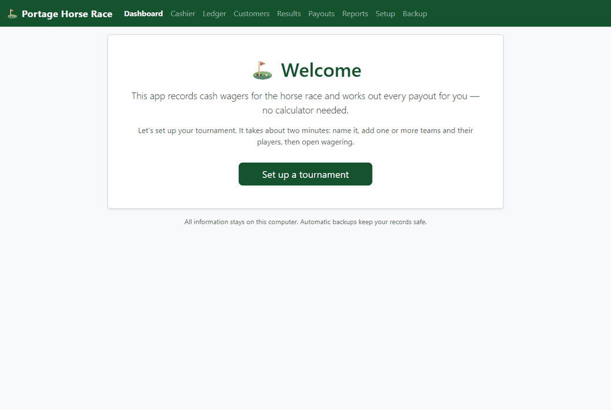

# Portage Horse Race — Wager Management

A small, **local-first Windows app** for running the horse race at the Portage Men's Open
golf tournament. It records cash wagers ($5 per entry) on players, keeps each team's prize
pool separate, assigns 1st/2nd/3rd place, and works out every customer's payout **exactly to
the cent** — no calculator or poster required.

Everything stays on one computer. It works with the internet disconnected, and it backs
itself up automatically so a volunteer can't lose the day's records.



---

## For tournament staff — installing & running

1. Download **`PortageHorseRace-Setup-<version>.exe`** from the
   [latest release](../../releases/latest).
2. Double-click it and click through the installer (no administrator password needed).
3. Launch **Portage Horse Race** from the desktop or Start Menu. It opens in your web browser.
4. To stop it, close the small app window (or the browser tab and window).

Your data lives in `%LOCALAPPDATA%\PortageHorseRace` and is **kept when you install an update**.

## Using it (quick guide)

1. **Setup** — Create a tournament (name, $5 entry, 15% club, 60/30/10 split are pre-filled),
   add your two teams and their players, then **Open wagering**.
2. **Cashier** — Find or add the customer → pick the team → pick the player →
   choose how many entries → take the cash → **Record payment**. The next sale starts
   automatically.
3. **Fixing a mistake** — On the Cashier or Ledger screen, press **Void** on the wager and
   give a reason. Totals reverse instantly; nothing is ever secretly deleted.
4. **Results** — After the race, on the **Results** screen pick 1st/2nd/3rd for each team,
   check the preview, and **Generate payouts**.
5. **Payouts** — Work down the **To pay** list; press **Mark paid** for each customer. A
   customer can't be paid twice.
6. **Unclaimed pools** — if a placed player had no wagers, that pool appears on the Payouts
   screen and you record what happens to it (return to club / carry over / handle manually)
   before the event is marked settled.
7. **Reports & backup** — **Reports** has printable summaries (including a Results report that
   discloses the exact remainder-cent allocation) and CSV exports. **Backup** lets you make or
   restore a backup at any time.
8. **Next event** — when you're done, **Archive & start a new tournament** from Setup. All
   past records are kept and an archived tournament can be reopened later.

An **administrator PIN** (set under *Backup*) can protect voids, result changes, payout
reversals, restores and archiving. It is stored only as a salted hash, never in plain text.

---

## For developers

**Requirements:** Python 3.12+ (built and tested on 3.13).

```bash
py -3.13 -m venv .venv
.venv/Scripts/python -m pip install -e ".[dev]"
.venv/Scripts/python -m pytest          # run the test suite
.venv/Scripts/python run.py             # run the app locally
```

### Architecture

- **FastAPI + SQLAlchemy 2 + SQLite (WAL)**, server-rendered **Jinja2 + HTMX**, Bootstrap
  bundled locally (no CDN — works offline).
- Money is stored as **integer cents**, percentages as **basis points**. All money math lives
  in `app/services/calculations.py` (pure, no I/O) and is covered by unit tests, including
  the specification's worked example and deterministic remainder-cent allocation that
  reconciles every payout pool exactly.
- Business logic is isolated in `app/services/`; routes are thin.
- No hard deletes of financial records — corrections are voids + an append-only audit log.

### Layout

```
app/
  main.py          launcher wiring, startup backup, localhost bind
  config.py        %LOCALAPPDATA% data directories
  database.py      engine + SQLite pragmas (FK, WAL, busy timeout)
  models/          ORM models + status constants
  services/        calculations, wagers, payouts, teams, dashboard, ledger,
                   customers, setup, exports, backups, audit
  routes/          FastAPI routers (thin)
  templates/ static/
tests/             unit (money engine) + integration (full flows)
packaging/         PyInstaller spec + Inno Setup installer script
```

### Building the Windows installer

```bash
.venv/Scripts/python -m PyInstaller packaging/horse_race.spec --noconfirm
"%LOCALAPPDATA%\Programs\Inno Setup 6\ISCC.exe" packaging/installer.iss
# -> dist/installer/PortageHorseRace-Setup-<version>.exe
```

Built from the specification in `Portage_Mens_Open_Horse_Race_App_Specification_v2.docx`.
